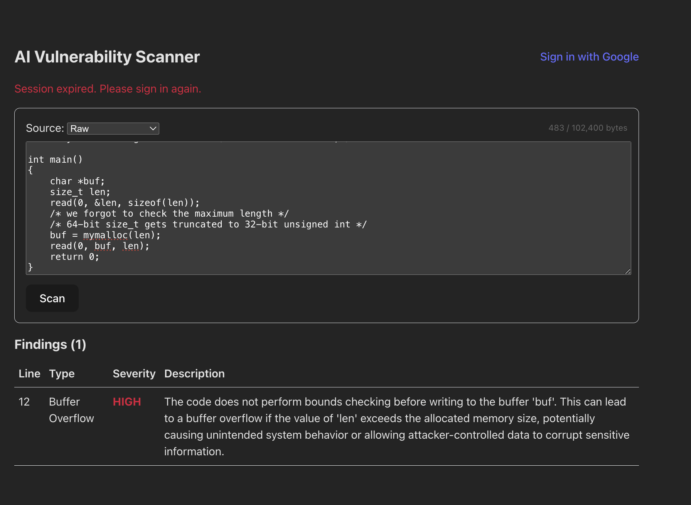

# AI Vulnerability Scanner

A tiny full-stack project that scans code for security issues using an LLM. Built to learn modern TS/Node patterns: auth with Google OAuth + JWT, schema-first validation, and clean logging.

## Features
- **Auth**: Google OAuth 2.0 (Passport) → JWT (15m) with per-login `jwtSecureCode` rotation
- **Scan API**: `POST /api/scan` → prompts LLM and returns structured findings (line, type, severity, description)
- **Frontend**: minimal React (Vite) UI to sign in, paste code, and view results
- **DB**: Prisma + SQLite for users/scans/vulnerabilities
- **Logging**: Pino with request correlation
- **Planned**: per-user Redis rate limiting + usage headers

## Example
```
/* An example of an ERROR for some 64-bit architectures,
if "unsigned int" is 32 bits and "size_t" is 64 bits: */
#include <unistd.h>
#include <stdlib.h>
#include <stdlib.h>
void *mymalloc(unsigned int size) { return malloc(size); }

int main()
{
    char *buf;
    size_t len;
    read(0, &len, sizeof(len));
    /* we forgot to check the maximum length */
    /* 64-bit size_t gets truncated to 32-bit unsigned int */
    buf = mymalloc(len);
    read(0, buf, len);
    return 0;
}
```


## Stack
TypeScript • Express • Passport (google + jwt) • Prisma (SQLite) • React (Vite) • Pino • Zod • OpenRouter (DeepSeek model)

